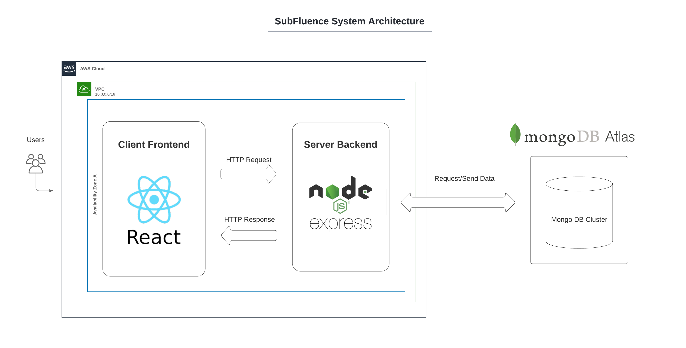

## Introduction

Welcome to Subfluence, a revolutionary video sharing service and tutoring platform designed to help students get personalized assistance with their class materials, 24/7! With the ongoing pandemic and limited availability of traditional tutoring resources, Subfluence aims to bridge the gap by offering a convenient way for students to access high-quality educational content and connect with teachers/tutors for their academic needs.

## Features

- **24/7 Availability:** Subfluence is accessible at any time, making it convenient for students with busy work/life schedules to get the help they need whenever and wherever.

- **Content Upload:** Teachers and business users can easily upload educational content, including lectures, tutorials, and study materials, to the platform's database.

- **Subscription Model:** Student users can subscribe to their preferred content creators, gaining access to personalized assistance and a streamlined learning experience.

- **MERN Stack:** The platform is built using the MERN stack, combining the power of MongoDB, Express.js, React, and Node.js to deliver a seamless user experience.

- **Cloud Infrastructure:** Subfluence is hosted on AWS, leveraging the capabilities of cloud services like EC2 virtual machine and MongoDB Atlas for database management.

## Technologies Used

- Frontend: React
- Backend: Node.js, Express.js
- Database: MongoDB Atlas
- Cloud Hosting: AWS (Amazon Web Services)

## Architecture

## Empathy Map

## Getting Started

To run the Subfluence application locally, follow these steps:

1. Clone the repository from GitHub.
2. Install the required dependencies for both frontend and backend using npm.
3. Set up your AWS account and configure the necessary services (e.g., EC2, MongoDB Atlas).
4. Connect the backend to your MongoDB Atlas database.
5. Start the development servers for frontend and backend.

## Usage

### Student User
1. Create an account or log in to Subfluence.
2. Explore the available content creators.
3. Subscribe to your preferred tutors/teachers to access their educational content.
4. Engage in personalized learning and seek assistance with your assignments.

### Teacher/Business User
1. Sign up as a content creator on Subfluence.
2. Upload your educational videos, lectures, tutorials, and study materials to the platform.
3. Gain visibility among students and build your subscriber base.
4. Help students succeed in their studies and earn money for your expertise.

## Demo

